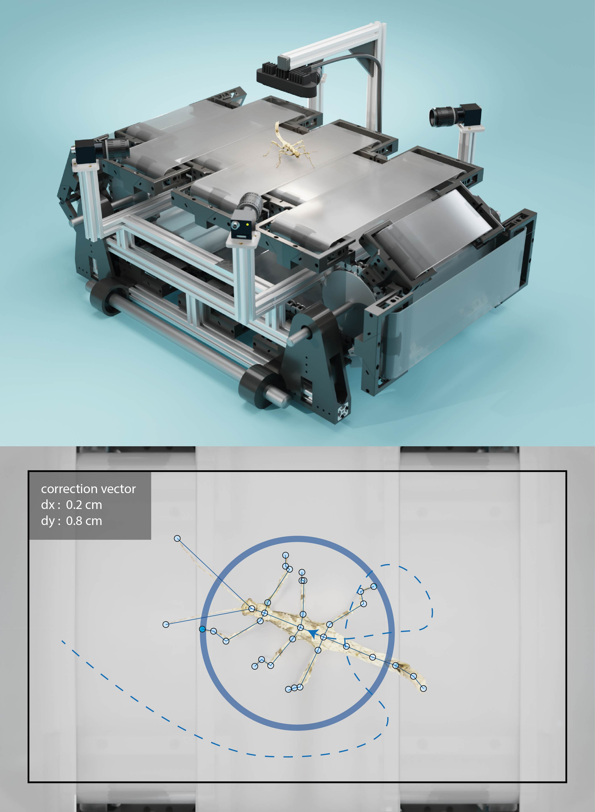
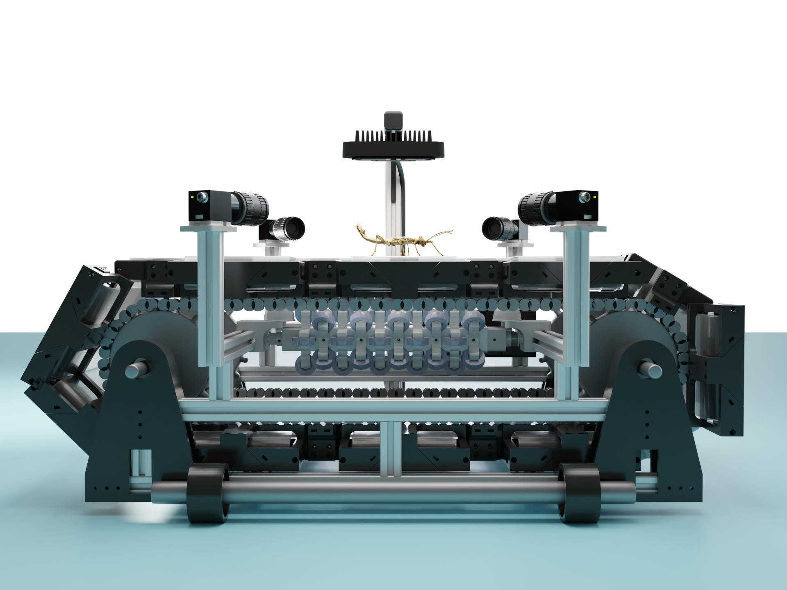
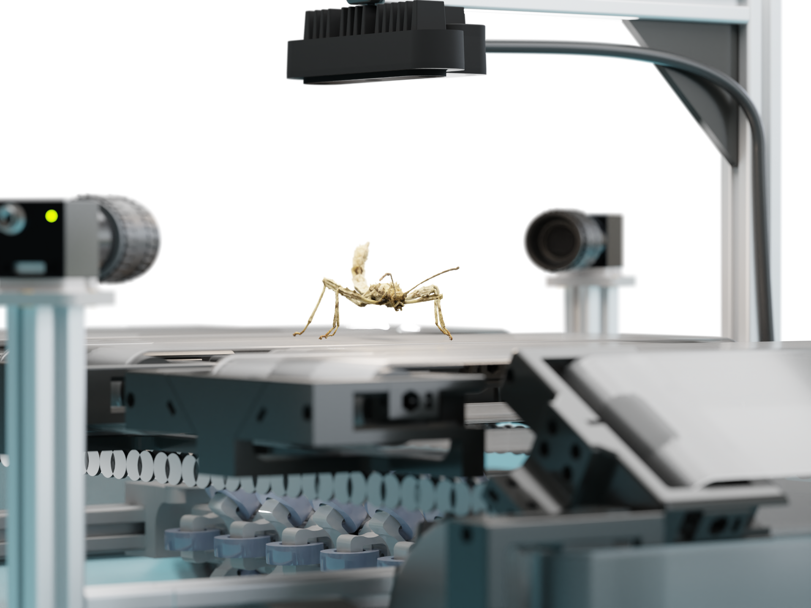
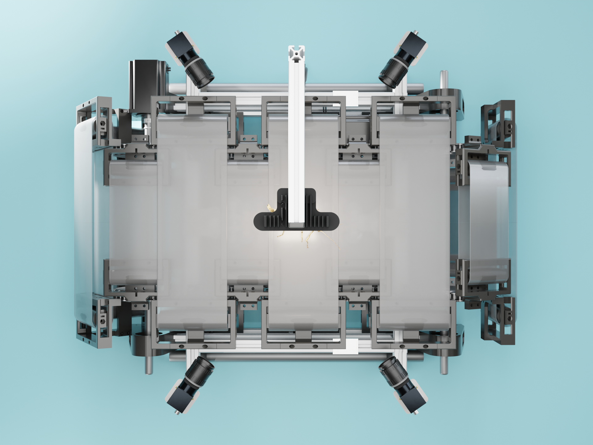

# 2DTreadmill

The omni-directional treadmill we were told not to build.



*"Yeah, I don't think that is going to work."*

## Installing dependencies

### **Python** OAK-D Environment Setup and example Execution

depthai environment for all actual inference things and the initial darknet -> tf conversion

```bash
conda create --name depthai python=3.7
conda activate depthai
```

then install additional dependencies

```bash
pip install depthai
pip install numpy==1.16.6
pip install tensorflow==1.14.0
pip install blobconverter==1.2.7
pip install openvino-dev[tensorflow]==2021.3
pip install Pillow
```

### **Arduino**

We try to keep the Arduino dependencies as light-weight as possible.
For now, all that is required is
the [PIDController library](https://www.arduino.cc/reference/en/libraries/pidcontroller/)

We're running an Arduino Mega 2560 and the latest [IDE](https://www.arduino.cc/en/software).



## TODOs

### rework parts


* **Main (X) axle holders [build fully aluminum frame model altogether]**
    * The mounting points for perpendicular struts need to be elongated to ensure that connecting struts can be
      mounted flush (important for the (X) motor mount)
    * The tolerance for the main (X) axles need to be adjusted so the printed material does not contact the axle
      itself
    * perhaps use double bearing (inside & outside)
    * The distance between the main (X) axles to the base struts needs to be increased by (at least) 2 cm to prevent
      the Y-belts from contacting the perpendicular facing base struts
    * The upwards pointing struts (inside the main (x) axle holders) need to sit flush on the base struts.
      Otherwise, it becomes difficult to mount perpendicular elements
    * only attach tensioning threads for X belts to one side in full frame (box) setup


* **Y belt carriers**
    * consider reinforcing tightening elements to avoid breaking during tracking adjustment
    * drum thickness to minimise distance between large and small segment elements
    * belt titghtening element between drums (to adjust distance of nylon rods)

### additional parts

* **base feet**
    * to be added to the base struts to provide clearance from the ground
    * make 6 feet in total, with dampening (using the left-over TPU cast wheels)
    * add M5 screws / threads with locking nuts inside them to make the exact height adjustable

 

* **guided rail**
    * requires adding guide wheels to (at least) the larger Y belt segments
    * Use guided rail for the upper side only, with on-ramping elements on either side to ensure level belts
* **perpendicular base struts**
    * add two outer struts to help with alignment, one added on each side
    * add (at least) one strut in the centre of the base (there is already one at a suitable length)
    * perhaps add a "foot" to the centre of the base frame to counteract sagging
* **belt guides (arms, coupled with Y belt carriers)**
    * add to (larger) belt carrier to guide smaller belts in and out when moving over sprocket

### order components

* t-nuts (as many as they will sell us, seriously)
* M20 bearings (for double-sided X axle mount)
    * double check that washers only contact inner ring of the bearing
* M20 spring washers
* M3 thread cutter
* M3 metal drill bit (set)
* roller bearings (for guide)
* M6 Nylon rods (for Y belt segments)
    * if unavailable use threaded steel rods
* aluminium struts 20 mm x 20 mm - _(8 x 1 m)_
* aluminium struts 40 mm x 20 mm - _(2 x 1 m)_ **[for vertical struts]**

***




***

## License

© Fabian Plum & Hendrik Beck, 2022
[MIT License](https://choosealicense.com/licenses/mit/)
